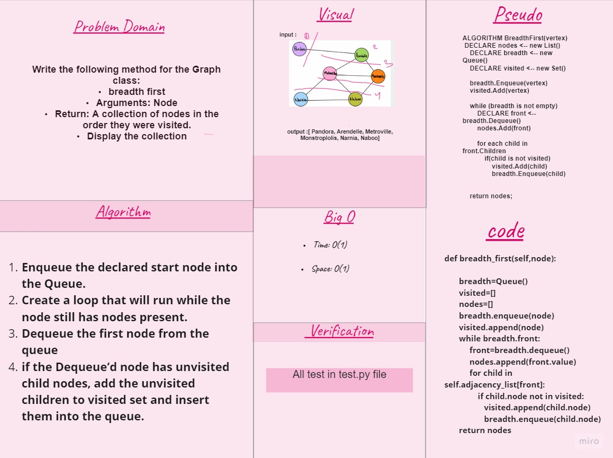
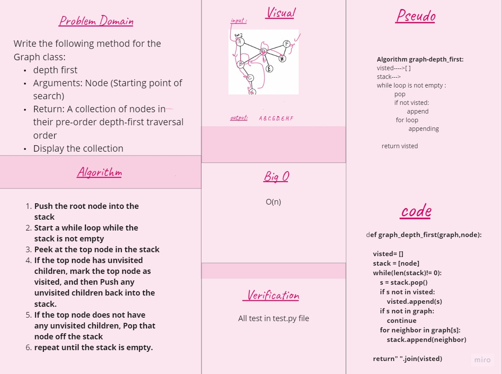

# Graphs
A graph is a non-linear data structure that can be looked at as a collection of vertices (or nodes) potentially connected by line segments named edges.

## Challenge
Implement your own Graph.
The graph should be represented as an adjacency list, and should include the following methods:

- add node
- add edge
- get nodes
- get neighbors
- size
- bradth-first

## Approach & Efficiency
O(1)

## API
- `add node`:Add a node to the graph, Arguments: value , Returns: The added node
- `add edge`: Adds a new edge between two nodes in the graph If specified, assign a weight to the edge Both nodes should already be in the Graph ,Arguments: 2 nodes to be connected by the edge, weight (optional) , Returns: nothing
- `get nodes`:Returns all of the nodes in the graph as a collection (set, list, or similar)
- `get neighbors`:Returns a collection of edges connected to the given node , Include the weight of the connection in the returned collection
- `size`: Returns the total number of nodes in the graph
- `bredth-first`: Return A collection of nodes in the order they were visited and Display the collection
- `depth_first` : Return A collection of nodes in their pre-order depth-first traversal order

## whiteboard CC36

## whiteboard CC37

