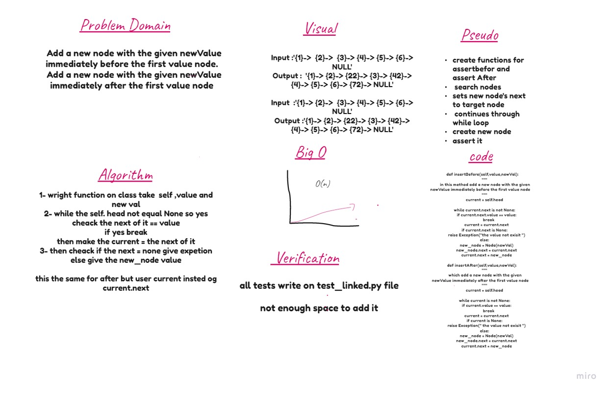

# Singly Linked List
A singly linked list is a type of linked list that is unidirectional, that is, it can be traversed in only one direction from head to the last node (tail). Each element in a linked list is called a node. A single node contains data and a pointer to the next node which helps in maintaining the structure of the list.
 

## Challenge
Create a Node class that has properties for the value stored in the Node, and traversed on it and doing some function 

## Approach & Efficiency
learn a lot about LinkedList how to deal with it and traversed throw it 

## Change Log
Challenge 05 10/6/2021 

-starting time: 5:30 pm
-Finish time: 7:30 pm

_____________________________________________

Challenge 06 13/6/2021

-starting time:7:30pm
-Finish time:9:30pm

## API
- `name=linkedlist()`= to creat a new linked list
- ` name.insert(value)`= Adds a node of a value to the head of LinkedList
- ` name.includes(value)`=Return T/F if value is in the linked list or not
- ` name.__str__(value)`=   "{ a } -> { b } -> { c } -> NULL" / Loop over all nodes / print all values in one line
- ` name.append(value)`= Adds a node of a value to the end of LinkedList
- `name.insertBefor(self,value,newVal)`= which add a new node with the given newValue immediately before the first value node.
- `name.insertAfter(self,value,newVal)`=which add a new node with the given newValue immediately after the first value node

_________________________________________________

## solution 

