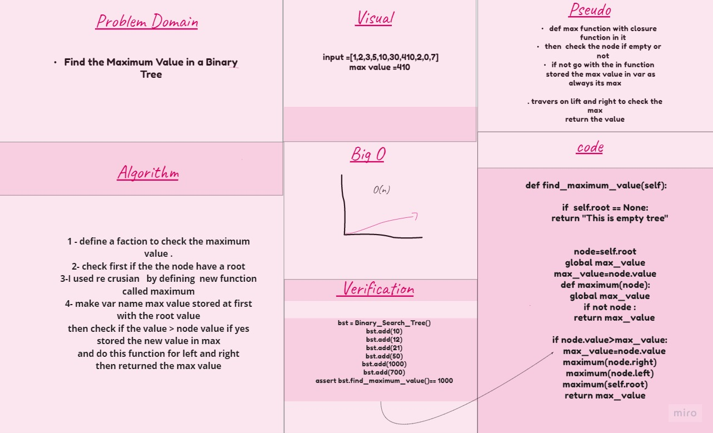
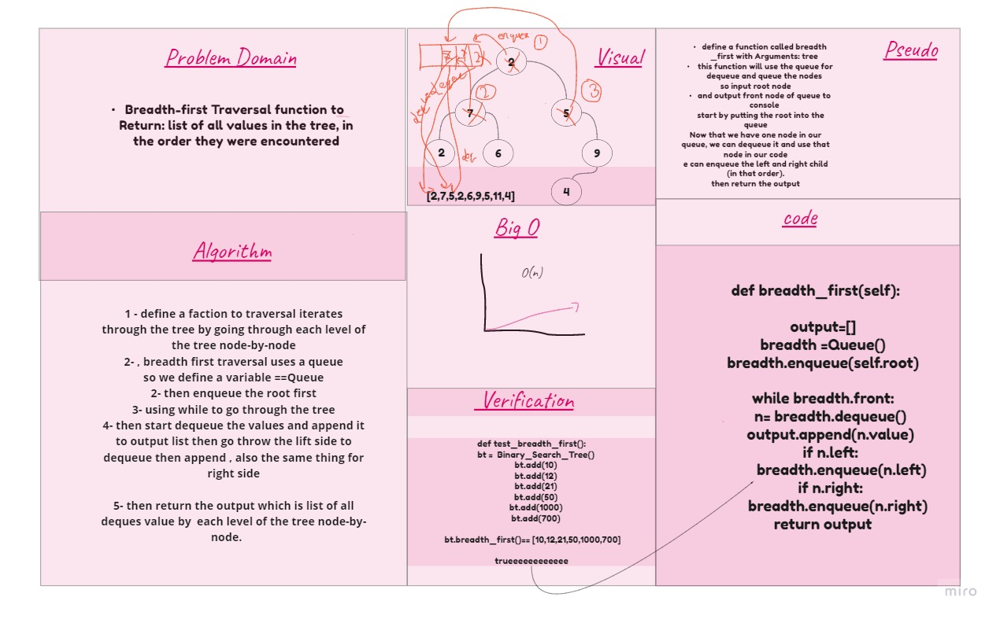
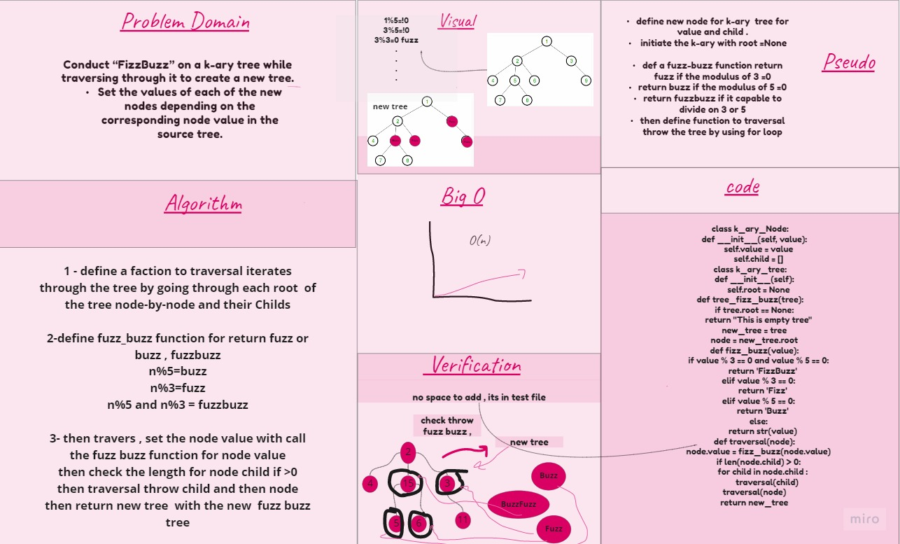

# Trees
Tree represents the nodes connected by edges. It is a non-linear data structure. It has the following properties.
One node is marked as Root node.
Every node other than the root is associated with one parent node.
Each node can have an arbiatry number of chid node.

_________________________________________________________________________________________________________________

### Challenge-15
1. `Node`
- Create a Node class that has properties for the value stored in the node, the left child node, and the right child node.

2. `Binary Tree`
- Create a Binary Tree class

- Define a method for each of the depth first traversals:
1. pre order
2. in order
3. post order
which returns an array of the values, ordered appropriately.

3. `Binary Search Tree`
- Create a Binary Search Tree class

This class should be a sub-class (or your languages equivalent) of the Binary Tree Class, with the following additional methods:
- Add
1. Arguments: value
2. Return: nothing
Adds a new node with that value in the correct location in the binary search tree.
- Contains
1. Argument: value
2. Returns: boolean indicating whether or not the value is in the tree at least once.
_________________________________________________________________________________________________________________

### Challenge-16
Write the following method for the Binary Tree class
`find maximum value`
- Arguments: none
- Returns: number
`Challenge Type`: Extending an Implementation
## Approach & Efficiency

- O(log(n))

## API
- class Tree :
- `preOrder` : priting the values of the tree by the order of `root >> left >> right`
- `inOrder` : priting the values of the tree by the order of `left >> root >> right`
- `postOrder`: priting the values of the tree by the order of `left >> right >> root`
- class Binary_Search_Tree:
- `add` : add anode to the tree according to its value
- `Contains` : check if there is a node with tha same value.
- `find_maximum_value` : Find the maximum value of a binary tree

## Solution :

_________________________________________________________________________________________________________________

### Challenge-17
Write a function called breadth first
- Arguments: tree
- Return: list of all values in the tree, in the order they were encountered
`Challenge Type`: Code Challenge / Algorithm

## Approach & Efficiency

- O(log(n))

## API
- class Tree :
- `preOrder` : priting the values of the tree by the order of `root >> left >> right`
- `inOrder` : priting the values of the tree by the order of `left >> root >> right`
- `postOrder`: priting the values of the tree by the order of `left >> right >> root`
- `find_maximum_value` : Find the maximum value of a binary tree
- `tree-breadth-first` :list of all values in the tree, in the order they were encountered 

- class Binary_Search_Tree:
- `add` : add anode to the tree according to its value
- `Contains` : check if there is a node with tha same value.

## Solution :

 ___________________________________________________________________________________________________________________________

 ### Challenge-18
Conduct “FizzBuzz” on a k-ary tree while traversing through it to create a new tree.

Set the values of each of the new nodes depending on the corresponding node value in the source tree.

- Arguments: k-ary tree
- Return: new k-ary tree
`Challenge Type`: Code Challenge / Algorithm

## Approach & Efficiency

- O(log(n))

## API
- class Tree :
- `preOrder` : priting the values of the tree by the order of `root >> left >> right`
- `inOrder` : priting the values of the tree by the order of `left >> root >> right`
- `postOrder`: priting the values of the tree by the order of `left >> right >> root`
- `find_maximum_value` : Find the maximum value of a binary tree
- `tree-breadth-first` :list of all values in the tree, in the order they were encountered 
- `tree-fizz-buzz` :Conduct “FizzBuzz” on a k-ary tree while traversing through it to create a new tree.
- class Binary_Search_Tree:
- `add` : add anode to the tree according to its value
- `Contains` : check if there is a node with tha same value.

## Solution :
