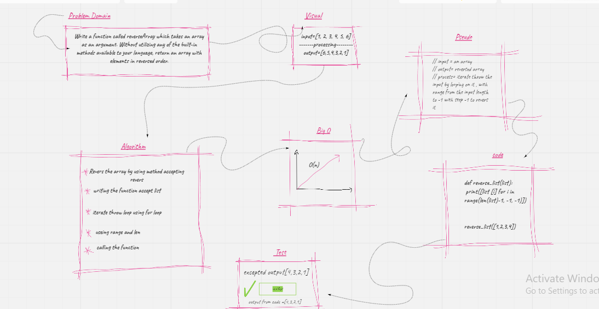

# array-binary-search

Binary search in a sorted 1D array

## Challenge
Write a function called BinarySearch which takes in 2 parameters: a sorted array and the search key. Without utilizing any of the built-in methods available to your language, return the index of the array’s element that is equal to the value of the search key, or -1 if the element is not in the array..

## Approach & Efficiency
I took the approach of making a for loop that loops through the input array by the range from the length to -1 with revers step -1 , Doing a for loop was what came to mind first then compleate it with  range 

## Solution

