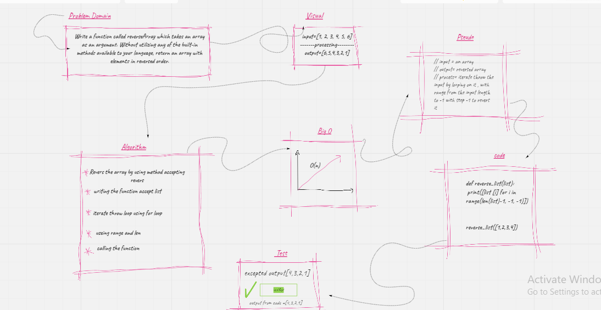

# Array Reverse

Reverse an array Without utilizing any of the built-in methods available 

## Challenge

Write a function called reverseArray which takes an array as an argument. Without utilizing any of the built-in methods available to your language, return an array with elements in reversed order.

## Approach & Efficiency
I took the approach of making a for loop that loops through the input array by the range from the length to -1 with revers step -1 , Doing a for loop was what came to mind first then compleate it with  range 

## Solution

