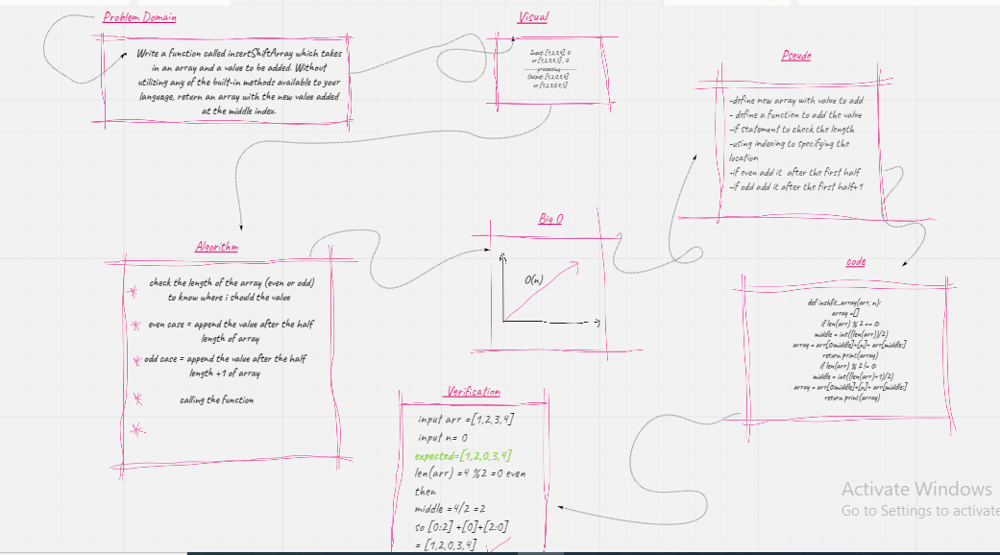

# Array Reverse

Reverse an array Without utilizing any of the built-in methods available 

## Challenge

Write a function called insertShiftArray which takes in an array and a value to be added. Without utilizing any of the built-in methods available to your language, return an array with the new value added at the middle index.

## Approach & Efficiency
I took the approach of taking the length than half it then adds the value by indexing but first we must to check the length to determine the accurate half

## Solution

