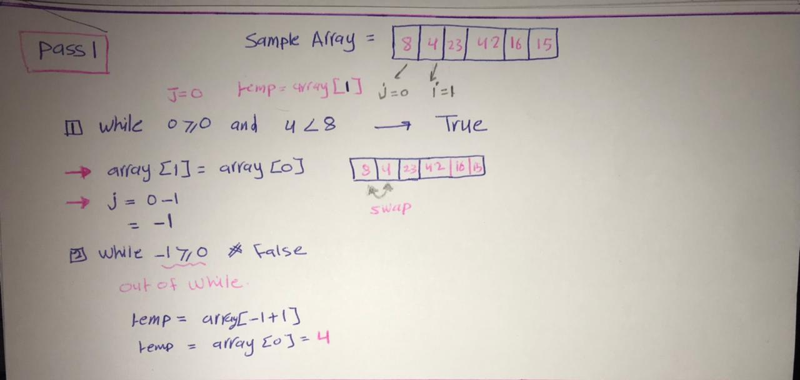
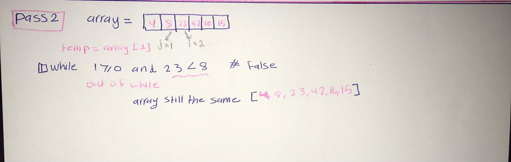
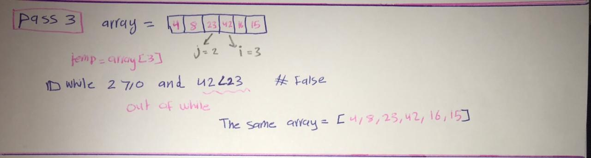
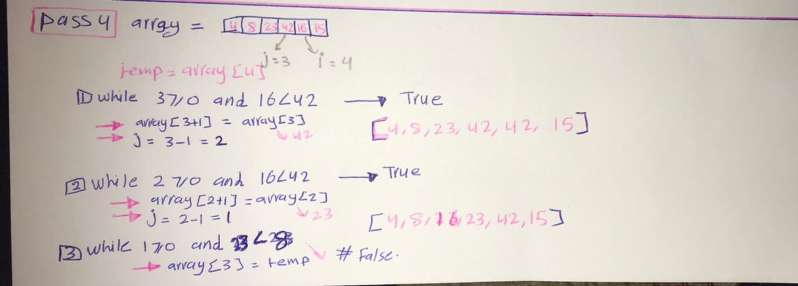
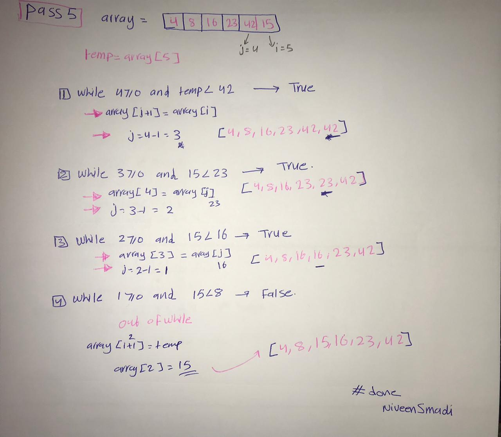

## Insertion Sort
Insertion sort is a simple sorting algorithm that works similar to the way you sort playing cards in your hands. The array is virtually split into a sorted and an unsorted part. Values from the unsorted part are picked and placed at the correct position in the sorted part.

## Pseudocode
```py
  InsertionSort(int[] arr)

    FOR i = 1 to arr.length

      int j <-- i - 1
      int temp <-- arr[i]

      WHILE j >= 0 AND temp < arr[j]
        arr[j + 1] <-- arr[j]
        j <-- j - 1

      arr[j + 1] <-- temp

```
## Trace
Sample Array: [8,4,23,42,16,15]

- Pass 1:



start from index0 , first element in the array(8) , and the next is array(4) , 4 smaller than 8 so we swap them. 
- Pass 2:



then take the third element array (23) its bigger than 8 so we keep it in same place .

- Pass 3:


then take the fourth element array (42)its bigger than 23 so we keep it in same place .
 
- Pass 4:



then take the fifyh element array(16) its smaller then array(42) so we swap them until its become bigger then an element 
- Pass 5:




then as pass 4 , take the sixth element array(15)in the array , smaller than 16 so we can swap them an so on until we git the correct sort 

```py
array_sorted = [4,8,15,16,23,42]
```

## Efficency
- Time: O(n^2)
The basic operation of this algorithm is comparison. This will happen n * (n-1) number of times…concluding the algorithm to be n squared.

- Space: O(1)
No additional space is being created. This array is being sorted in place…keeping the space at constant O(1).