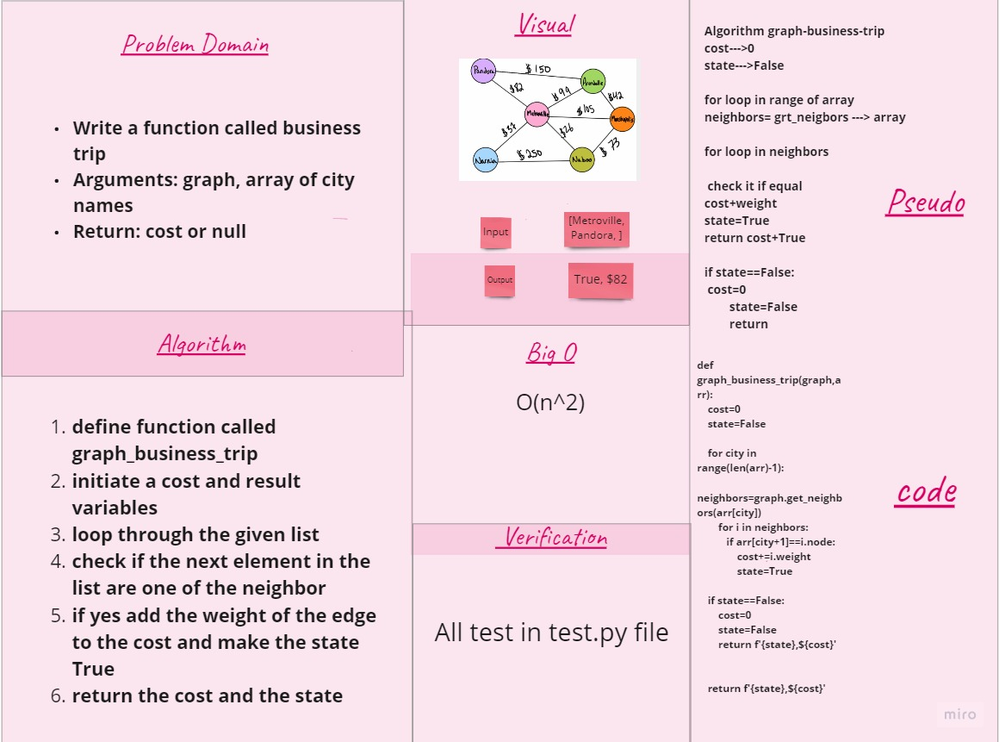

# Challenge Summary
Determine whether the trip is possible with direct flights, and how much it would cost.

## Approach & Efficiency

- Write a function called business trip

1)Arguments: graph, array of city names

2)Return: cost or null

3)Determine whether the trip is possible with direct flights, and how much it would cost.

## Whiteboard Process

