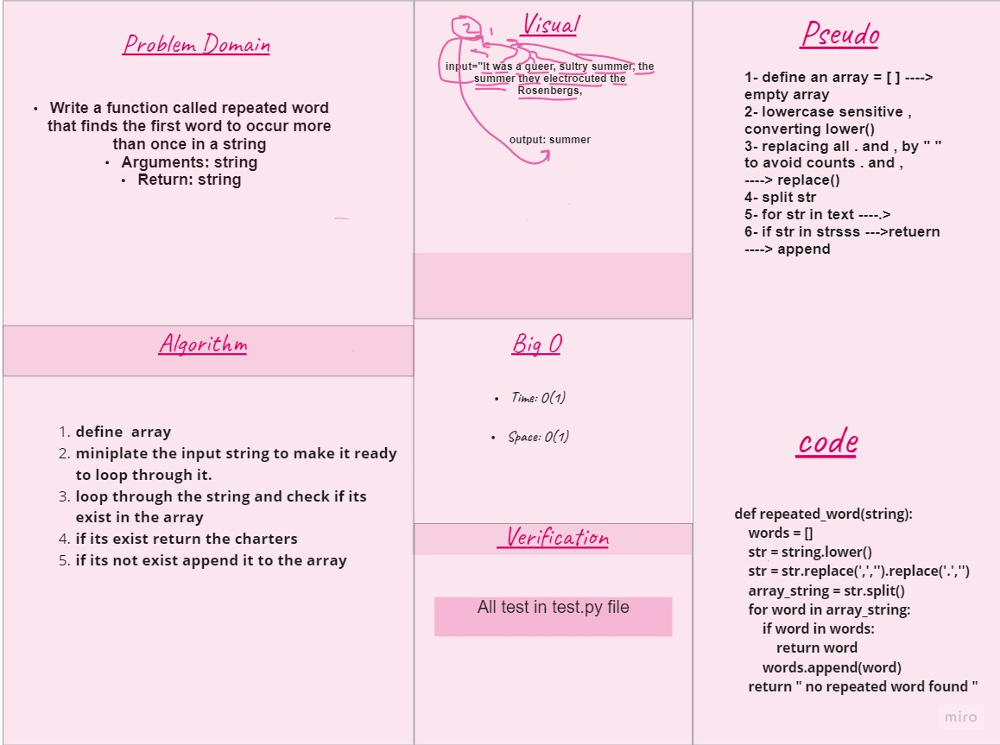

# Challenge Summary
Find the first repeated word in a book.

## Whiteboard Process

## Approach & Efficiency

Write a function called repeated word that finds the first word to occur more than once in a string
- Arguments: string
- Return: string

## Efficiency
- O(1) for Time 
- O(1) for space 
## Solution
- code : [py]()
- test : [py ]()
