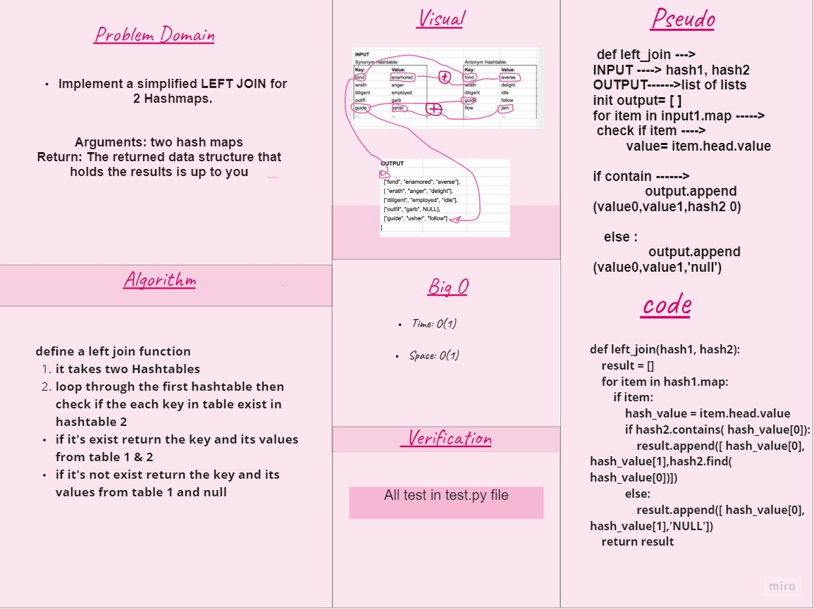

# Challenge Summary
Implement a simplified LEFT JOIN for 2 Hashmaps.

## Whiteboard Process

## Approach & Efficiency

- Write a function that LEFT JOINs two hashmaps into a single data structure.

Write a function called left join
1) Arguments: two hash maps
2) The first parameter is a hashmap that has word strings as keys, and a synonym of the key as values.
3) The second parameter is a hashmap that has word strings as keys, and antonyms of the key as values.
Return: The returned data structure that holds the results is up to you. It doesn’t need to exactly match the output below, so long as it achieves the LEFT JOIN logic

## Efficiency
- O(1) for Time 
- O(1) for space 

## Solution
- code : [py](https://github.com/NiveenAlSmadi/data-structures-and-algorithms/blob/main/challenges/left-join/left-join/code.py)
- test : [py ](https://github.com/NiveenAlSmadi/data-structures-and-algorithms/blob/main/challenges/left-join/tests/left-join.py)