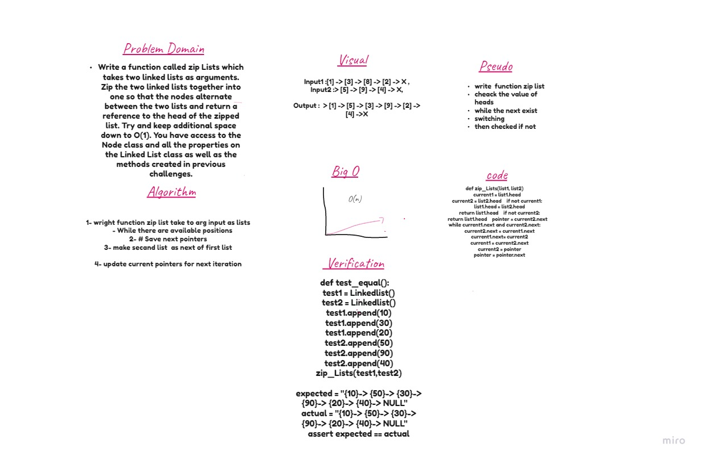

# ll-zip
Zip two linked lists.

## Challenge
Write a function called zipLists which takes two linked lists as arguments. Zip the two linked lists together into one so that the nodes alternate between the two lists and return a reference to the head of the zipped list. Try and keep additional space down to O(1). You have access to the Node class and all the properties on the Linked List class as well as the methods created in previous challenges.

## Approach & Efficiency
learn a lot about LinkedList how to deal with it and traversed throw it 

## Change Log
Challenge 08 15/6/2021 
________________________________________________________

-starting time: 9:30 pm
-Finish time: 11:30 pm

## solution /Challeng 8

