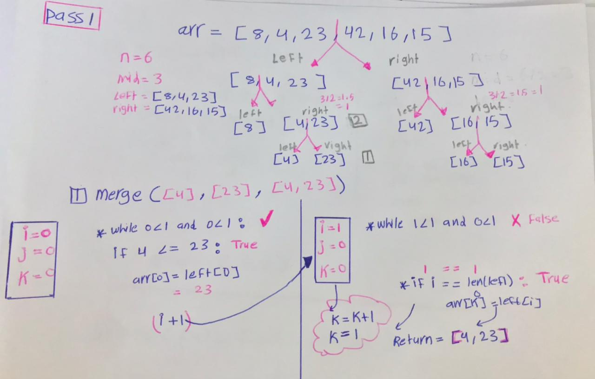
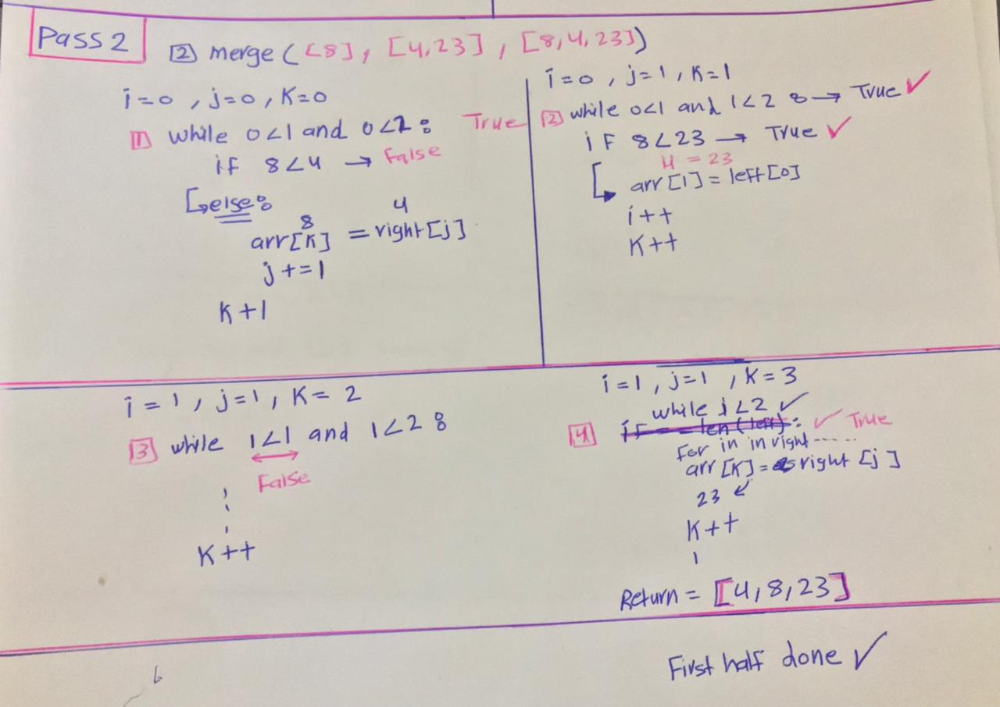
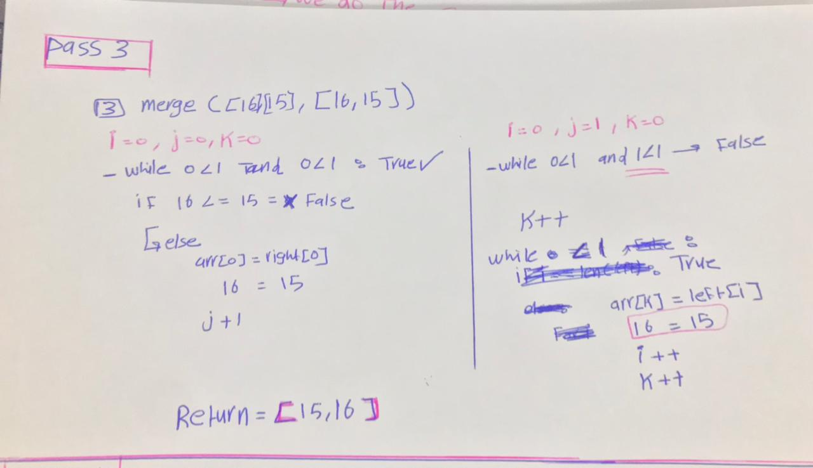
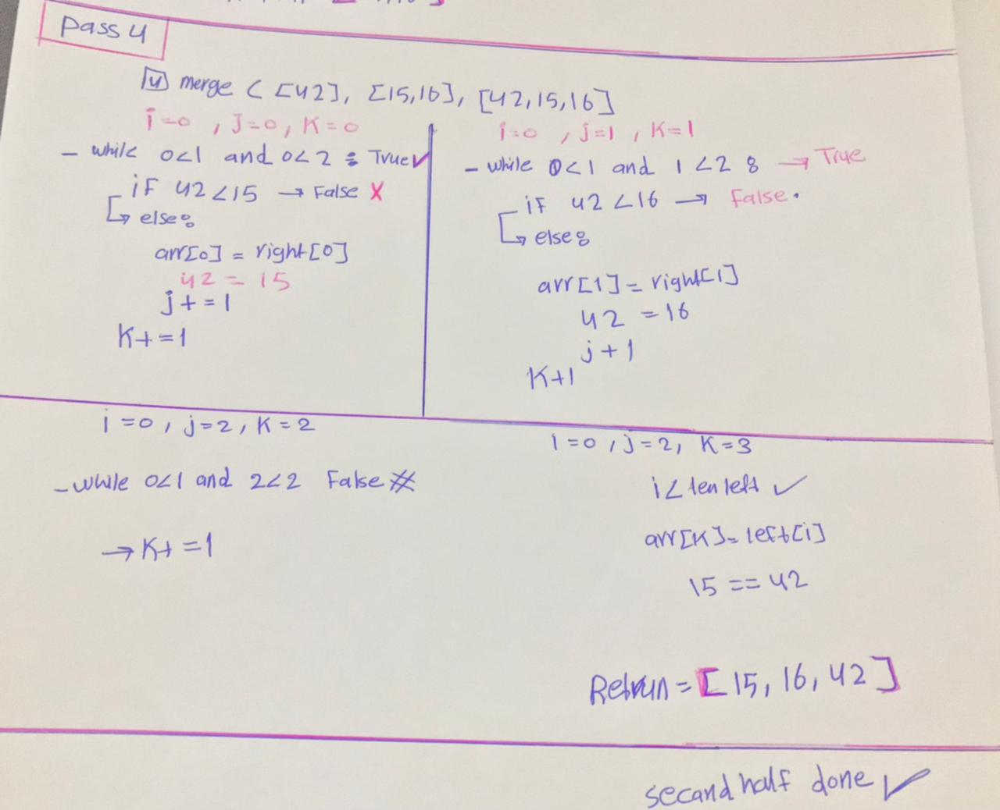
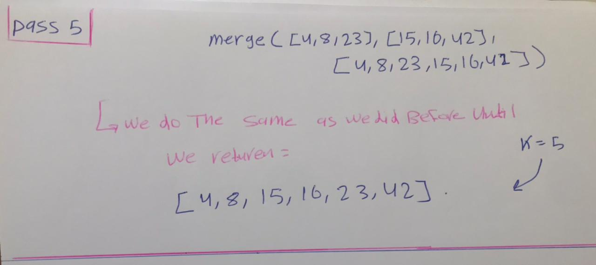

## Merge Sort
Merge Sort is a Divide and Conquer algorithm. It divides the input array into two halves, calls itself for the two halves, and then merges the two sorted halves. The merge() function is used for merging two halves. The merge(arr, l, m, r) is a key process that assumes that arr[l..m] and arr[m+1..r] are sorted and merges the two sorted sub-arrays into one.

## Pseudocode

```py
ALGORITHM Mergesort(arr)
    DECLARE n <-- arr.length

    if n > 1
      DECLARE mid <-- n/2
      DECLARE left <-- arr[0...mid]
      DECLARE right <-- arr[mid...n]
      // sort the left side
      Mergesort(left)
      // sort the right side
      Mergesort(right)
      // merge the sorted left and right sides together
      Merge(left, right, arr)

ALGORITHM Merge(left, right, arr)
    DECLARE i <-- 0
    DECLARE j <-- 0
    DECLARE k <-- 0

    while i < left.length && j < right.length
        if left[i] <= right[j]
            arr[k] <-- left[i]
            i <-- i + 1
        else
            arr[k] <-- right[j]
            j <-- j + 1

        k <-- k + 1

    if i = left.length
       set remaining entries in arr to remaining values in right
    else
       set remaining entries in arr to remaining values in left

```      

## Trace
Sample Array: [8,4,23,42,16,15]

- Pass 1:


 divides the input array into two halves by Finding the mid of the array then started from left side to diveds the arrays until the lenght of the  array becoumes 1 , then we start mergeing , start with the last left array(4) and last right array(23) ,next we go through the while loop to check 4<=23 true , so yes the index 0 of arr == left[0]==4
 then i++ , then goes through the while again , and its return false so we out from whiles , k++ , i < len(left):
 so will return [4,23] 

- Pass 2:


then we merge the left from divid 2 with the return array from pass1 as we said before

- Pass 3:


start with the secand half , merging the last left array(16) and last right array(15) ,next we go through the while loop and so on , will return [15,16]
 
- Pass 4:


then we merge the left from divid 2 with the return array from pass2 as we said before 

- Pass 5:


do as we did befor until we get the sorted array

```py
array_sorted = [4,8,15,16,23,42]
```

## Efficency
- Time: O(n^2)
The basic operation of this algorithm is comparison. This will happen n * (n-1) number of times…concluding the algorithm to be n squared.

- Space: O(1)
No additional space is being created. This array is being sorted in place…keeping the space at constant O(1).
