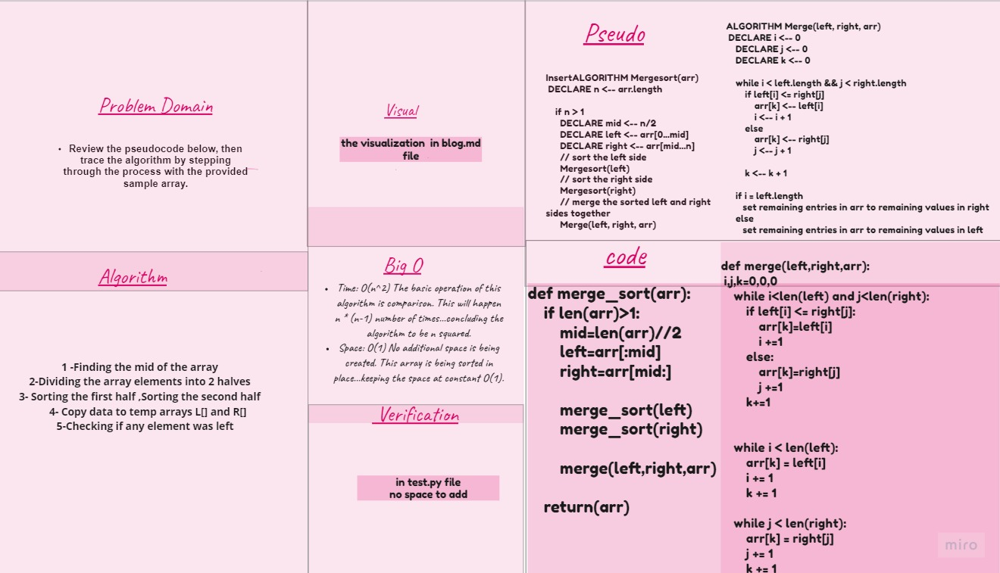

# MergSort

sorting array 

## Challenge

Review the pseudocode below, then trace the algorithm by stepping through the process with the provided sample array. Document your explanation by creating a blog article that shows the step-by-step output after each iteration through some sort of visual.

## Approach & Efficiency
following the Pseudocode 

## Solution

- BLOG :[md file](https://github.com/NiveenAlSmadi/data-structures-and-algorithms/blob/main/challenges/merge_sort/BLOG.md)
- code : [py](https://github.com/NiveenAlSmadi/data-structures-and-algorithms/blob/main/challenges/merge_sort/merge_sort/merge_sort/code.py)
