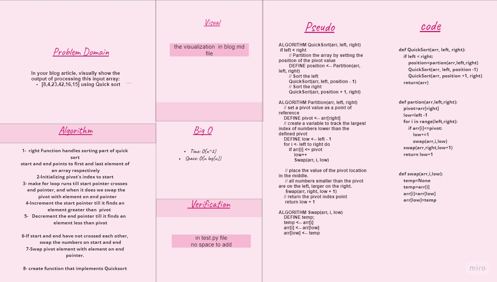

# QuickSort

sorting array 

## Challenge

Review the pseudocode below, then trace the algorithm by stepping through the process with the provided sample array. Document your explanation by creating a blog article that shows the step-by-step output after each iteration through some sort of visual.
Once you are done with your article, code a working, tested implementation of Quick Sort based on the pseudocode provided.

## Approach & Efficiency
following the Pseudocode 

## Solution

- BLOG :[md file](https://github.com/NiveenAlSmadi/data-structures-and-algorithms/blob/main/challenges/quick_Sort/BLOG.md)
- code : [py](https://github.com/NiveenAlSmadi/data-structures-and-algorithms/blob/main/challenges/quick_Sort/quick_Sort/merge_sort/code.py)