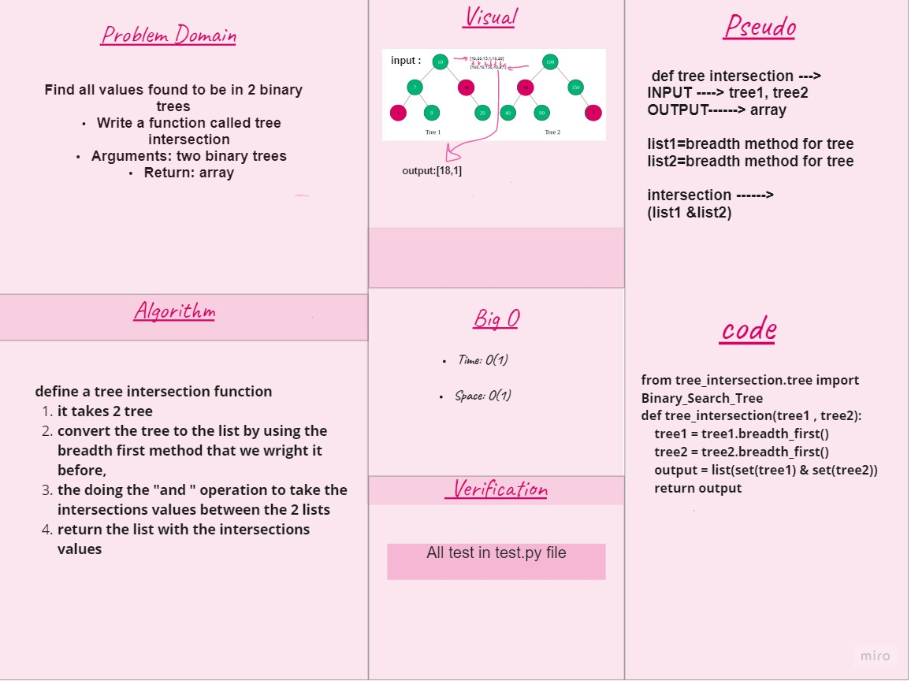

# Challenge Summary
Find common values in 2 binary trees.

## Whiteboard Process

## Approach & Efficiency

- Find all values found to be in 2 binary trees

Write a function called tree intersection

- Arguments: two binary trees
- Return: array

## Efficiency
- O(1) for Time 
- O(1) for space 
## Solution
- code : [py](https://github.com/NiveenAlSmadi/data-structures-and-algorithms/blob/main/challenges/tree-intersection/tree-intersection/code.py)
- test : [py ](https://github.com/NiveenAlSmadi/data-structures-and-algorithms/blob/main/challenges/tree-intersection/tests/test_tree-intersection.py)